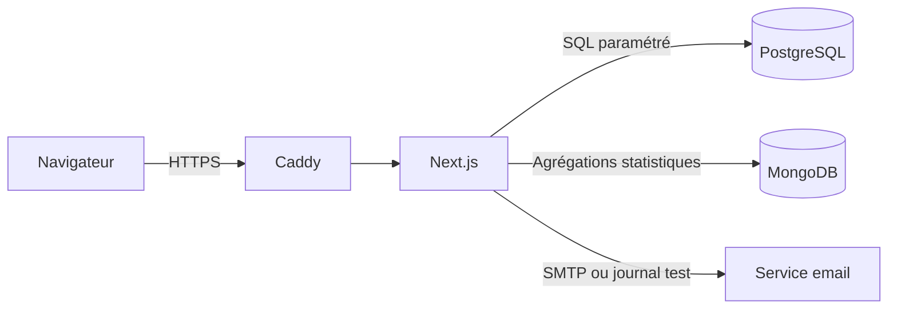
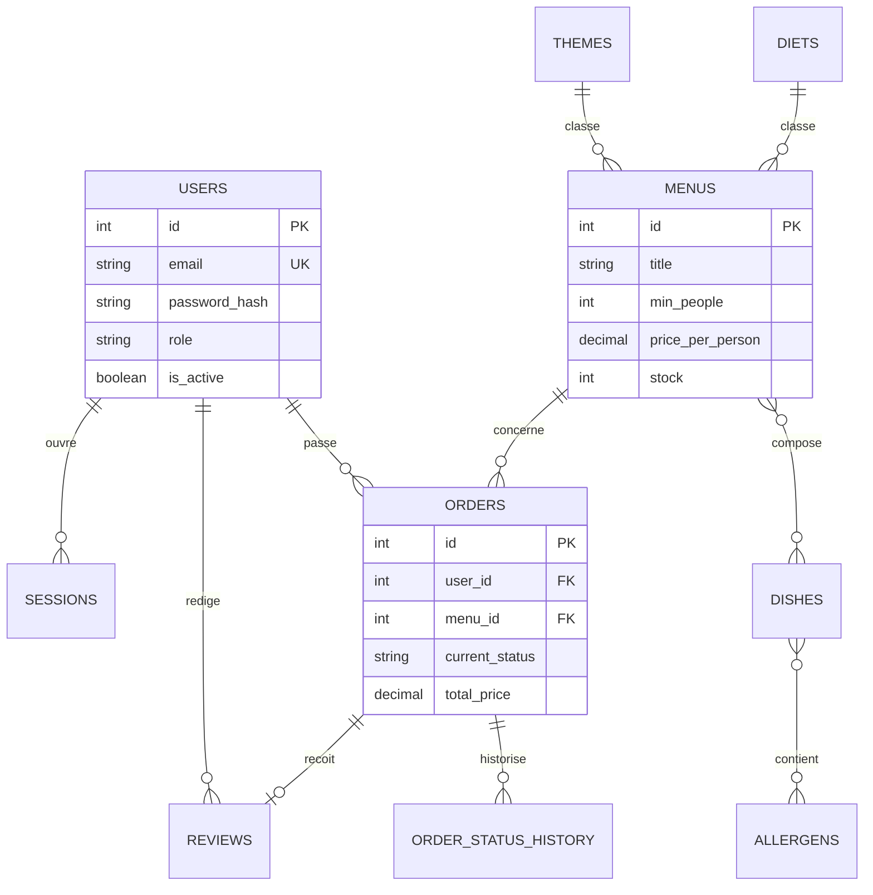
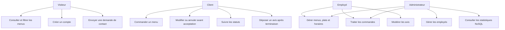
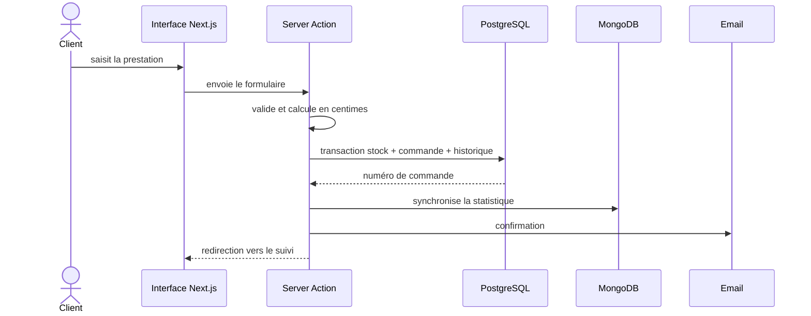

# Documentation technique — Vite & Gourmand

Version du 19 juillet 2026 — Lucas Gimenez

## 1. Objectif et périmètre

Vite & Gourmand est une application web responsive de consultation et de commande de menus pour un traiteur bordelais. Elle couvre quatre profils : visiteur, client, employé et administrateur. Le produit gère le catalogue, les commandes et leur historique, les avis modérés, les horaires, les comptes employés et les statistiques.

## 2. Choix technologiques

- Next.js 16 App Router, React 19 et TypeScript strict : front et logique serveur dans un seul déploiement.
- Tailwind CSS 4 : interface responsive et cohérente avec la charte.
- PostgreSQL 17 : données relationnelles et contraintes métier.
- MongoDB 8 : statistiques administrateur, conformément à l'exigence NoSQL.
- SQL direct avec le pilote `pg` : requêtes visibles, paramétrées et faciles à expliquer.
- Docker Compose et Caddy : environnement reproductible, bases non exposées et HTTPS automatique.
- Bun pour l'installation, le lint et les tests ; Node.js pour le runtime de production Next.js.

Les alternatives front/API séparés et ORM ont été écartées afin de limiter le nombre de services et de conserver une preuve explicite de maîtrise SQL.

## 3. Environnement de travail

Prérequis : Git, Bun, Node.js 20 ou supérieur et Docker Desktop. Après clonage : copier `.env.example` vers `.env`, lancer `bun install`, `docker compose up -d`, `bun run db:reset`, puis `bun dev`. Les commandes de validation sont documentées dans le README.

## 4. Architecture

Les pages et composants vivent dans `src/app` et `src/components`. Les Server Actions valident les formulaires avec Zod, contrôlent le rôle côté serveur et appellent les fonctions de données de `src/lib`. PostgreSQL reste la source métier ; MongoDB contient une projection des commandes destinée aux statistiques.

## 5. Modèle conceptuel de données

Le schéma complet et les contraintes sont dans `sql/01_create.sql`. Les données de démonstration sont dans `sql/02_seed.sql`.

## 6. Cas d'utilisation

## 7. Séquence de commande

## 8. Règles métier

Le nombre de convives respecte le minimum du menu. Une réduction de 10 % s'applique à partir de cinq convives au-dessus de ce minimum. Bordeaux bénéficie de la livraison gratuite ; ailleurs, les frais sont de 5 € plus 0,59 € par kilomètre. Tous les calculs utilisent des centimes entiers. Le stock est décrémenté dans une transaction. Les transitions de statut sont contrôlées par une machine à états et historisées.

## 9. Sécurité et RGPD

- mots de passe hachés avec bcrypt, coût 12 ;
- cookie de session `httpOnly`, `sameSite=lax`, `secure` en production ;
- autorisation vérifiée dans les layouts et chaque Server Action ;
- validation Zod côté serveur et requêtes SQL paramétrées ;
- messages génériques de connexion et de récupération de mot de passe ;
- jeton de réinitialisation signé HMAC, valable 30 minutes, puis révocation des sessions ;
- CSP, anti-framing, `nosniff`, politique de référent et permissions réduites ;
- secrets exclus de Git et injectés par variables d'environnement ;
- PostgreSQL et MongoDB inaccessibles depuis Internet en production ;
- mentions légales, CGV et information sur les données personnelles accessibles publiquement.

## 10. Tests et qualité

Biome vérifie le formatage et les règles d'accessibilité. TypeScript est exécuté sans émission. Les tests unitaires couvrent les prix et la machine à états. Playwright couvre les parcours des quatre rôles et le responsive. Le build Next.js constitue le contrôle de production. Les résultats datés sont consignés dans `.agent-forge/VERIFICATION.md`.

## 11. Déploiement

Créer le DNS A du sous-domaine vers le VPS, ouvrir 80/443, cloner le dépôt et copier `.env.production.example` vers `.env`. Générer `POSTGRES_PASSWORD` et `AUTH_SECRET`, renseigner `DOMAIN`, `APP_URL`, `ACME_EMAIL` et les emails. Lancer `docker compose -f docker-compose.prod.yml up -d --build`, puis initialiser la démonstration avec `docker compose -f docker-compose.prod.yml exec app node scripts/reset-db.ts`. Contrôler `docker compose ... ps` et la réponse HTTPS.

## 12. Limites et améliorations

Le mode email sans SMTP journalise les messages pour la démonstration. En exploitation réelle, il faut configurer SMTP, ajouter une limitation de fréquence distribuée sur l'authentification, sauvegarder automatiquement les deux bases et superviser les conteneurs.
